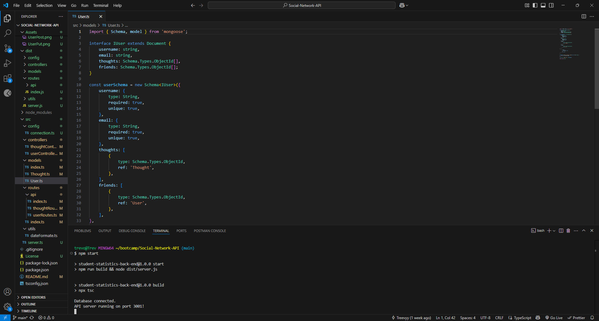
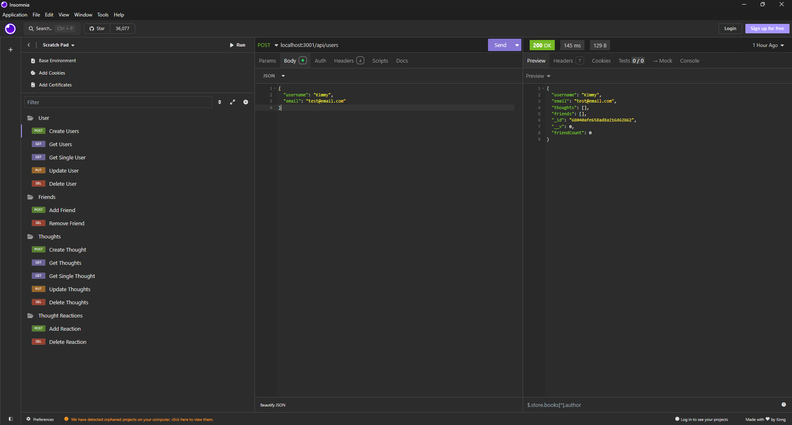
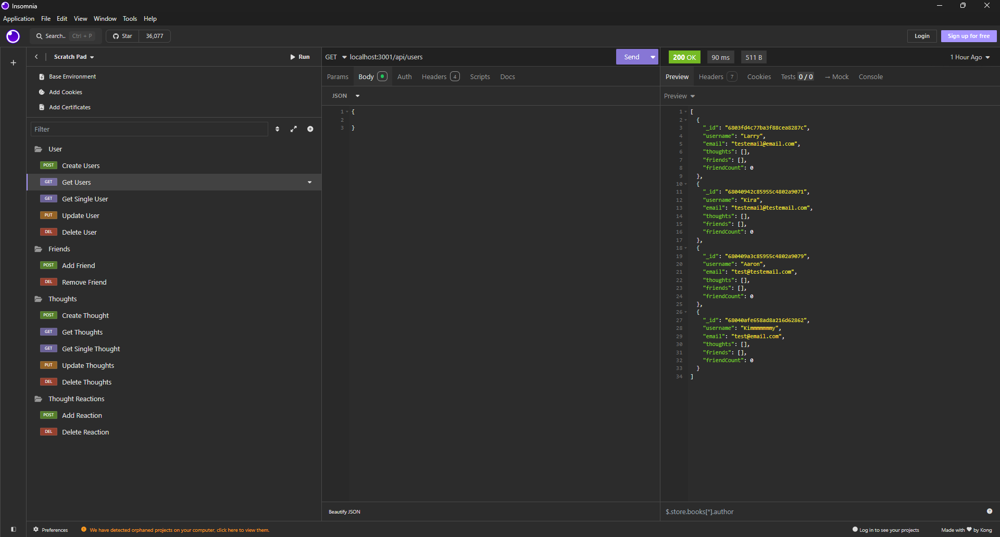
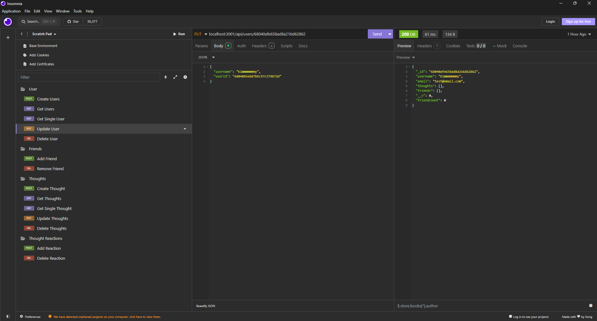
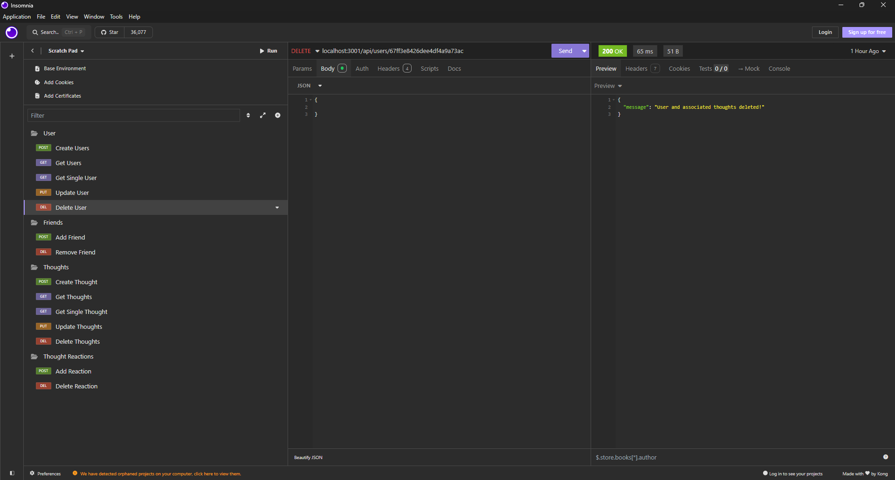

# Social Network API
  

  ## Description
  The Social Network API is a back-end application built with Node.js, Express.js, MongoDB, and Mongoose. It allows users to share thoughts, react to friends' thoughts, and manage a friend list mimicking the essential backend structure of a modern social media platform. This API uses a NoSQL database to efficiently handle large amounts of unstructured data and is tested using Insomnia for all CRUD operations. The project includes full implementation of RESTful routes for users and thoughts, along with nested routes for reactions and friendships.

  ## Table of Contents
  - [Installation](#installation)
  - [Usage](#usage)
  - [Technologies](#technologies)
  - [Screenshots](#screenshots)
  - [Walkthrough Video](#walkthrough-video)
  - [URL Link](#url-link)
  - [Contributing](#contributing)
  - [Contributors](#contributors)
  - [Tests](#tests)
  - [License](#license)
  - [Questions](#questions)

  ## Installation
  
  1. Git clone: git@github.com:Treevyy/Social-Network-API.git

  2. Navigate to the project directory: cd Social-Network-API

  3. Right click the root package.json file and click open in integrated terminal

  4. Inside the terminal install the dependencies with the command: npm i

  5. Start MongoDB locally in the terminal by running the command: mongod, or via MongoDB Atlas

  6. After dependencies are installed run the application with the command: npm start

  ## Usage
  To test the API:

  1. Run the application using npm start in your terminal.

  2. Use Insomnia, Postman or any API client to make GET, POST, PUT, and DELETE requests to the available endpoints.

  3. The API supports:

    - Creating, reading, updating, and deleting users and thoughts
    - Adding and removing friends
    - Reacting to and removing reactions from thoughts

  4. This application is not deployed; all testing is done locally via an API client.

  ## Technologies
 

 

 

 

 

  ## Screenshots
  
  

  

  

  

  

  ## Walkthrough Video
  A demo of the application can be found at the following link: https://drive.google.com/file/d/1USuTK3OpDaSEx6LQWmUx_XwgnUdPOKol/view

  ## URL Link
  There is no URL link to this application.
  
  ## Contributing
  No contributions are needed for this project.

  ## Contributors
  Thank you to the professor and TA's for all you help with this challenge!

  1. Trevor Moore aka Treevyy

  2. Dan Mueller

  3. Quentin Jones

  4. Andrea Presto

  ## Tests

  1. Make sure the latest version of mongoDB is installed, check by using the command: mongo --version in your terminal

  2. Run the server at the package JSON in your root level inside your terminal run the command: npm start

  3. Open Insomnia and test routes like:

    - GET localhost:3001/api/users
    - POST localhost:3001/api/thoughts
    - PUT localhost:3001/api/users/userId
    - DELETE localhost:3001/api/users/userId

  4. Verify proper JSON responses and database updates:
  
    - If route requires information under your http or localhost:3001 address click body
    - Then for structured select JSON
    - Inside this body make it a object by using curly braces {}
    - Fill the information that is require inside the object like so 
    {
	"username": "Trevy",
	"email": "test@email.com"
    }

  ## License
  This project is licensed under the MIT license.

  ## Questions
  If you have any additional questions, you can contact me at:
  - GitHub: [Treevyy](https://github.com/Treevyy)
  - Email: [aarontrevormoore@gmail.com](mailto:aarontrevormoore@gmail.com)
